# 포팅매뉴얼


## Gittle 소개

### 🧸Gittle 은  Git 초심자들을 위한 Git Gui 서비스입니다.🧸

   프로그래밍을 막 시작한 당신, git이 어려우신가요?😥

   🍎**Gittle🍎**을 통해 쉽게 깃과 친해져보세요!

   **🍎GIttle🍎**은 아래의 기능을 제공합니다.

- 상세한 도움말
- github login
- repository 생성 / clone / 열기
- git add / commit / push
- git pull
- git log 확인
- merge request 보내기 / 목록 확인 / 디테일 확인
- branch list 확인, branch 생성 / 삭제 / 이동
- 터미널 열기
- git 동작 수행 시 명령어 확인

## 기술 스택

1. 작업 관리 : Jira
2. 형상 관리 : Gitlab
3. 메신저 : Mattermost
4. 개발 환경
    1. OS : Window 10
    2. IDE : Visual Studio Code 1.69.2
    3. 패키지 매니저 : yarn 1.22.19
    4. 프론트엔드 및 백엔드 :
        1. React  18.2.0
        2. Node.js : 16.17.1
        3. Electron :21.2.0
        4. Express : 4.18.2

---

## 사용법

### 실행하는 경우

```bash
#클론받은 이후
cd gittle
yarn i
#server.js 도 같이 실행됨
yarn start
```

### 실행파일을 생성하는 경우

```bash
#클론받은 이후
cd gittle
yarn i
yarn run build
yarn run dist
```

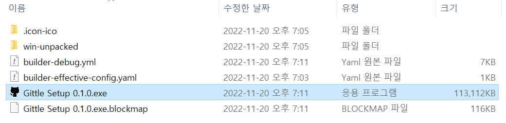

생성된 dist 디렉토리에서 `Gittle Setup 0.1.0.exe` 를 실행해 설치

### 실행파일을 다운로드 받는 경우

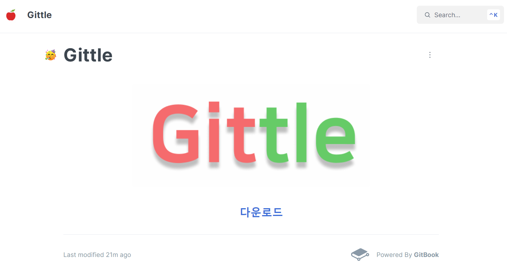

[다운로드](https://gittle.gitbook.io/download/)

해당 링크에서 실행파일을 다운로드 받은 후 실행

## Github Oauth (Device Flow)

1. Github Apps 등록

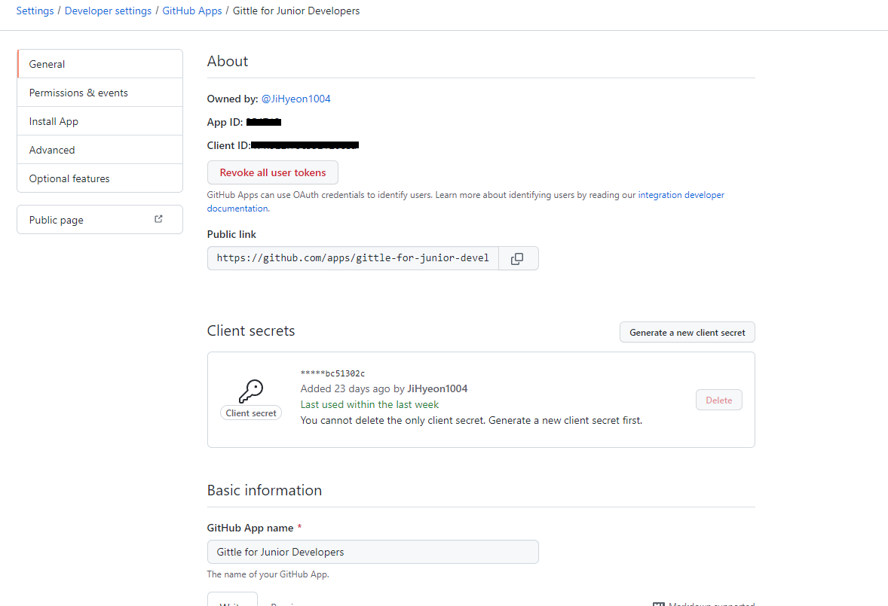

- Client Id와 Client secrets 은 별도로 저장해 놓습니다.

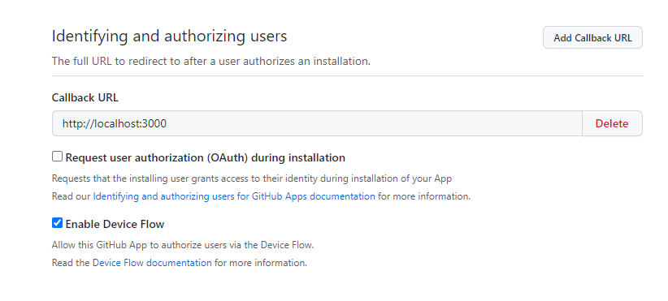

- electron app에서는 device flow를 통해 oauth를 구현하므로 enable device flow에 체크해 주어야합니다.

1. device_code/user_code 요청

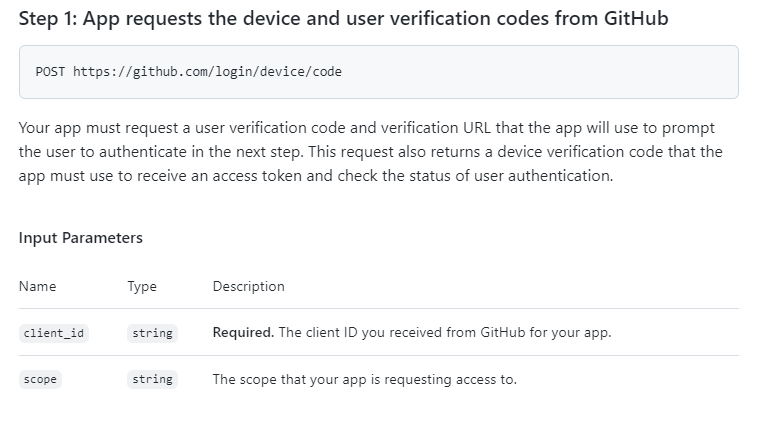

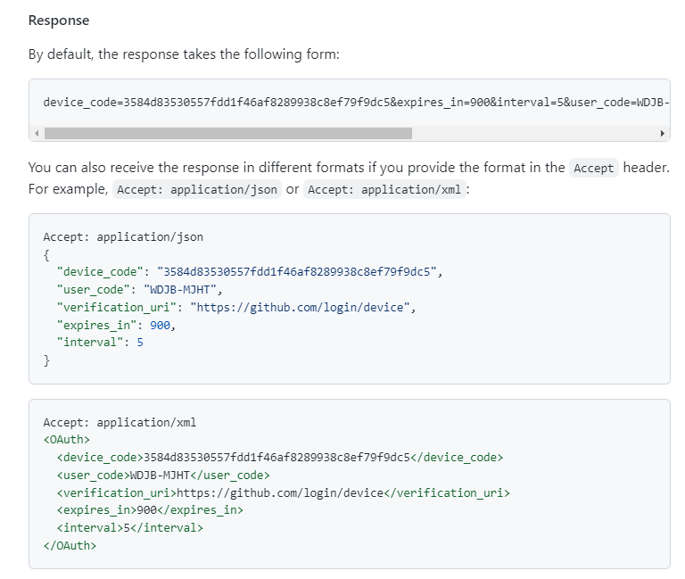

- POST 요청을 통해 device_code와 user_code 등이 담긴 response를 받습니다.
- Accept: application/json을 넣어 json형식의 response를 받을 수 있습니다.

1. user_code 입력

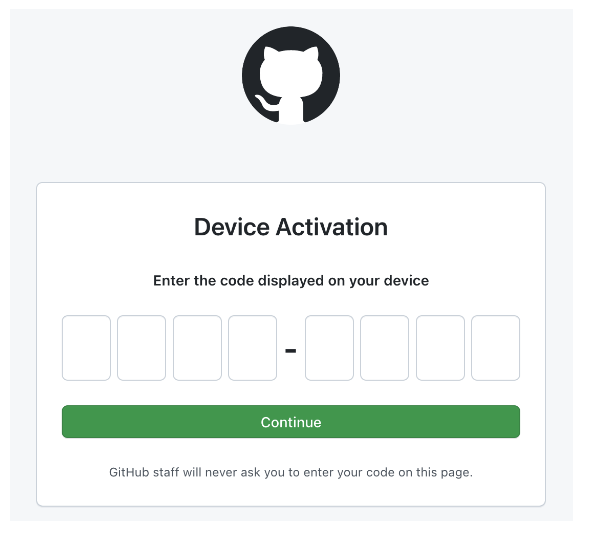

- [https://github.com/login/device](https://github.com/login/device) 를 팝업으로 띄워 user code를 입력할 수 있도록 합니다.
- 옳은 user code가 제출되면 github에서 해당 device를 승인합니다.

1. access token 요청

![Untitled]./gittle/src/assets/screenImage/oauth6.png)

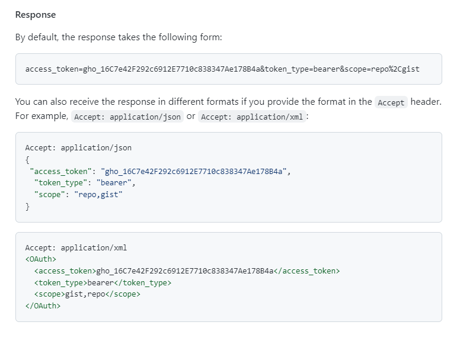

- client_id, device_code, grant_type을 포함하여 POST 요청을 보냅니다.
- access_token이 담긴 response를 받을 수 있으며, 마찬가지로 json 형식으로 받는 것이 가능합니다.
- github oauth device flow가 완료되었습니다.

---
## 시연 시나리오

### 메인페이지
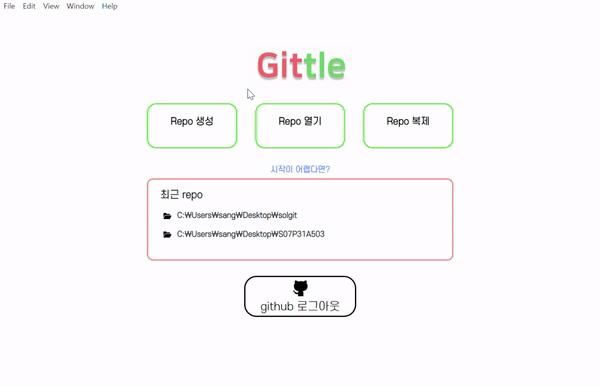

### add, reset
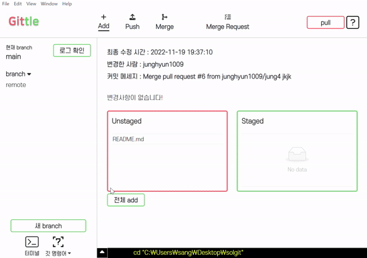

### 도움말
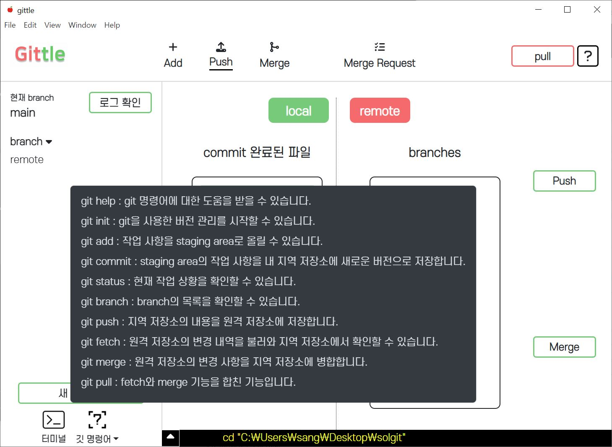

### merge
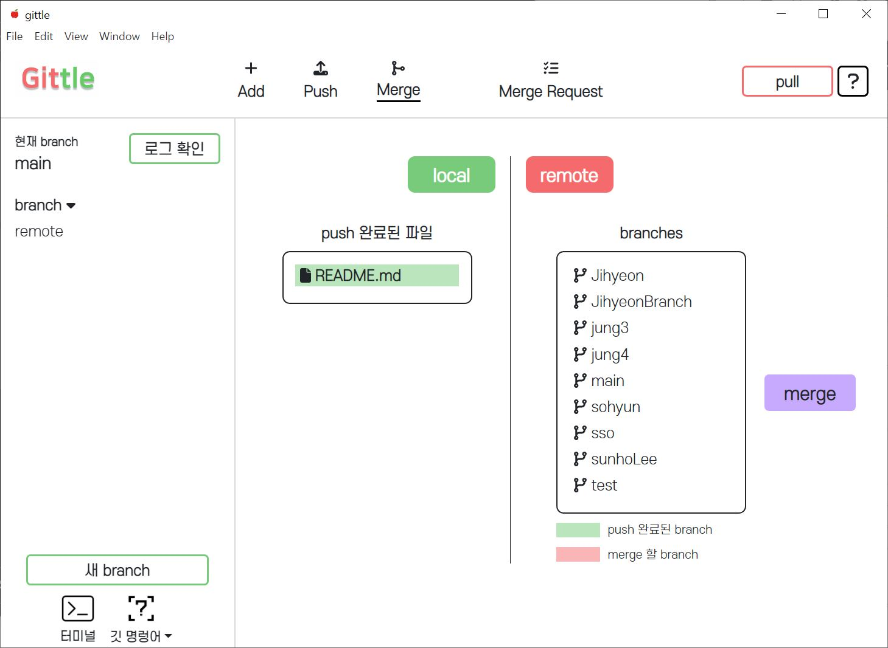
### mergeRequest

### push
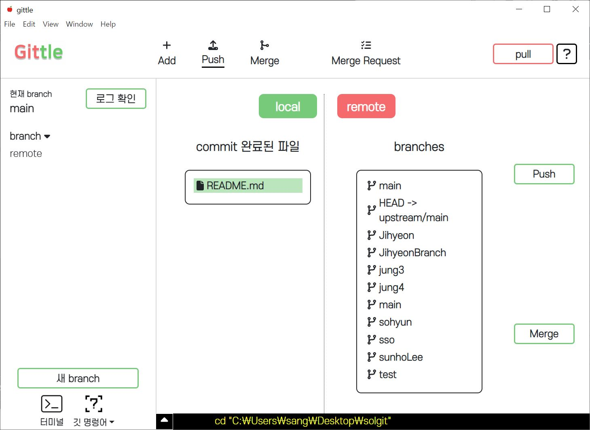
---
## ignore된 파일

### .env

```bash
BROWSER=none
REACT_APP_GITHUB_CLIENT_ID = (발급받은 클라이언트 ID)
REACT_APP_GITHUB_CLIENT_SECRET = (발급받은 클라이언트 SECRET)
# 아래에서 하나만 사용 가능 나머지는 주석처리
# ssafy 서버를 사용하는 경우
REACT_APP_SERVER_BASE_URL = http://k7a503.p.ssafy.io:4000
# server.js를 사용하는 경우
REACT_APP_SERVER_BASE_URL = http://localhost:4000
```# solgit
# solgit
